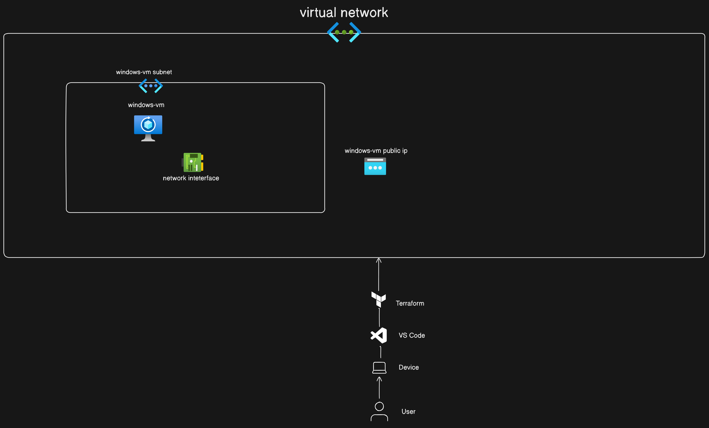

# Azure VM Infrastructure Project



This project uses Terraform to deploy a virtual machine infrastructure on Azure. It includes resources for Windows and Linux virtual machines, a Network Security Group (NSG), availability set, virtual machine scale set, Remote Desktop Services (RDS), and SSH access.

## Table of Contents

* Requirements
* Project Overview
* Infrastructure Resources
* Setup and Usage
* Outputs
* Contributing

## Requirments

* Terraform version 1.3 or later
* Azure CLI for authentication
* An Azure subscription

## Project Overview

This Terraform project creates a complete infrastructure for running virtual machines in Azure. The resources include:

* Windows and Linux virtual machines
* Network Security Groups (NSGs) with defined inbound/outbound rules
* An availability set for high availability of virtual machines
* A virtual machine scale set for scaling workloads
* Remote Desktop Services (RDS) on Windows VM with SSH access for Linux VM
  
## Infrastructure Resources

* Resource Group: Holds all the infrastructure components for easy management.
* Virtual Network (VNet): Provides networking for virtual machines and other resources.
* Subnets: Separate subnets for Windows and Linux VMs for isolation.
* Network Security Group (NSG): Controls traffic in/out of subnets, allowing specific ports for RDS and SSH.
* Availability Set: Ensures high availability of VMs by distributing them across fault domains.
* Virtual Machine Scale Set: Scales virtual machines based on load.
* Windows Virtual Machine: Configured with RDS.
* Linux Virtual Machine: Configured with SSH access.
* Storage Account: Stores VM disks and diagnostics data.

## Setup and Usage

1. Clone the Repository

```powershell

git clone https://github.com/rcoffie/AZ-VM-Infrastructure.git
cd azure-vm-infrastructure

```

2. Configure Terraform

```powershell

az login
az account set --subscription "your-subscription-id"

```

3. Modify Variables

Edit variables.tf to set the following variables or pass them at runtime:

 * <code> resource_group_name</code>: Name of the Azure resource group.
* <code> location </code>: Azure region (e.g., eastus, westus).
* <code> admin_username </code>: Administrator username for both Windows and Linux VMs.
* <code> admin_password </code>: Administrator password (secure this in a safe place).
  
4. Iniialize Terraform

```powershell
terraform init
```

5. Review and Apply Chanages

```powershell
terraform plan
```

6. Apply the changes to create resources

```powershell
terraform apply
```

6. Access the VMS
   
* Windows VM: Use Remote Desktop (RDP) to connect via the public IP. Ensure RDP is allowed in the NSG.
* Linux VM: Use SSH to connect using the public IP address:
  
```powershell
ssh admin_username@linux_vm_public_ip

```

## Clean-Up 

To destroy all resources, run:

```powershell
terraform destroy

```

## Conribution

Contributions are welcome! Please fork the repository and submit a pull request.
